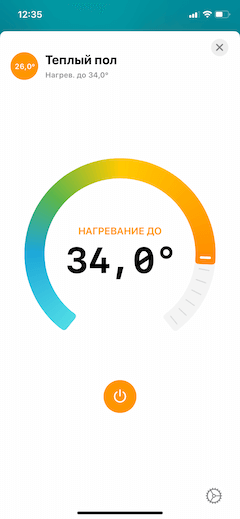
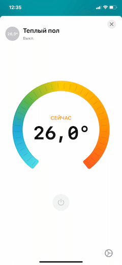
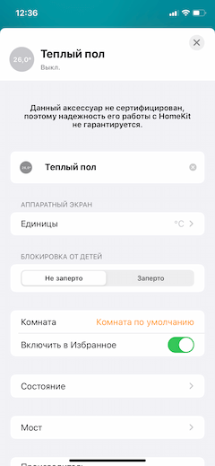
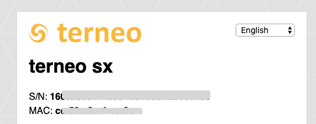

# homebridge-terneo-heatfloor


[](https://github.com/wiistriker/homebridge-terneo-heatfloor/stargazers)
[](https://github.com/wiistriker/homebridge-terneo-heatfloor/issues)

Homebridge plugin for Terneo floor heaters http://terneo.ua/ which work
with local API and doesnt require terneo cloud access.


  


By default this plugin use temperature in range of 5 and 40 and update current state
every 60 seconds. When you set temperature to 5, device go to scheduled mode (todo: make it configurable)

# Installation

1. Install homebridge. Please refer to official documentation how to do it.
2. Install this plugin using: `npm install -g homebridge-terneo-heatfloor`
3. Update your configuration file

# Configuration

Add to your configuration file:

```
{
    "accessory": "TerneoHeatfloor",
    "name": "Теплый пол",
    "ip": "192.168.1.90",
    "serial": "160025001143504D3130342D000159"
}
```

- `accessory` – always must be "TerneoHeatfloor"
- `name` – give a name for this accessory
- `ip` – ip address of your device
- `serial` – serial number of your device

## Where i can get ip address?

Please refer to terneo official documentation how to obtain ip address of your device.
You also can obtain it on your router.

## Where i can get serial number of my device?

When you obtain ip address, open in your browser address `http://<ip>`, for example
`http://192.168.1.90`



Copy long line of text in `S/N`

# Policy

The author is not responsible for the use and consequences of use of this software.

License
----

MIT
